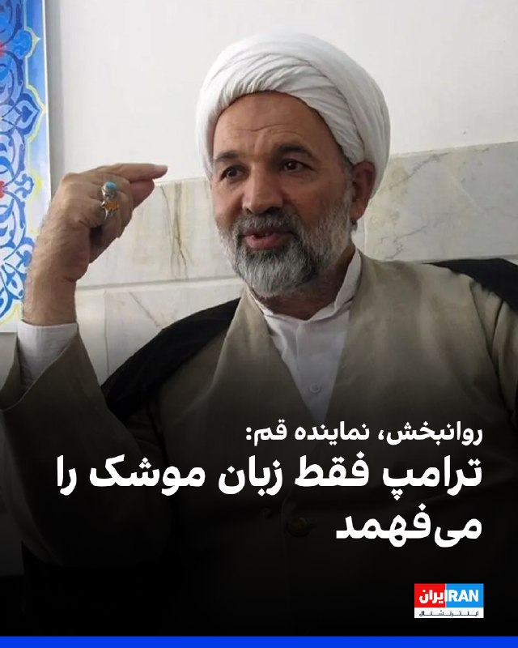
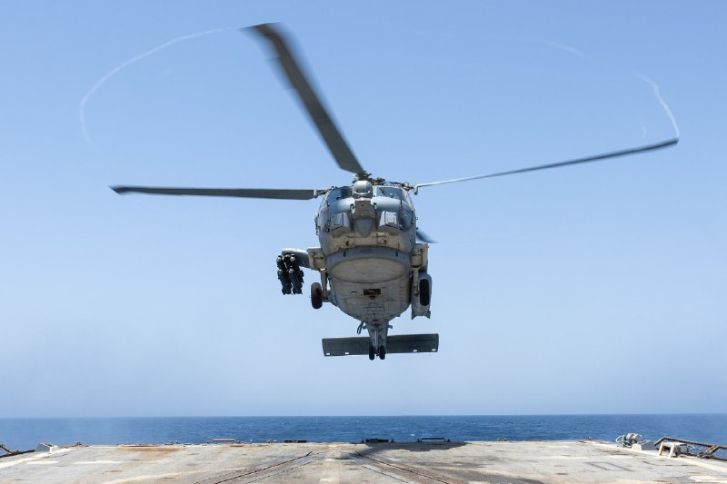

# خواننده تلگرام

<!-- TOP_NAV START -->

<a href="https://github.com/ProAlit/aio-downloader/blob/main/telegram/content/archive_1.md" style="display:inline-block; padding:6px 12px; margin:0 4px; background-color:#2ea44f; color:white; text-decoration:none; border-radius:4px; font-weight:bold;">صفحه بعد</a>

<!-- TOP_NAV END -->

<!-- MSG START -->

---
📅 بروزرسانی: 1405/02/24 17:04
---

## VahidOOnLine — post 240121

  

قاسم روانبخش، عضو هیات رییسه کمیسیون امور داخلی کشور و شوراها در مجلس، گفت نقشه راه جمهوری اسلامی کاملا روشن است و دستگاه دیپلماسی موظف است دقیقا بر مبنای ۱۰ شرط شورای عالی امنیت ملی که مورد تایید مجتبی خامنه‌ای است، حرکت کند.
قاسم روانبخش گفت عقب‌نشینی از ۱۰ شرط شورای عالی امنیت ملی یا افزایش سقف مطالبات طرف مقابل، باعث جری‌تر شدن دشمن و تشدید زیاده‌خواهی‌های او خواهد شد و افزود: «وظیفه مسئولان است که به طرف مقابل بفهمانند اگر مسیر عقلانیت را انتخاب نکند، جمهوری اسلامی ابزارهای دیگری در اختیار دارد»
قاسم روانبخش گفت: «ترامپ زبان دیپلماسی را نمی‌فهمد و تنها زبانی که به خوبی درک می‌کند، زبان موشک و قدرت نظامی است» او افزود ترامپ در شرایطی راهی پکن شد که ابهت ناوها و ناوشکن‌های آمریکا با موشک‌های جمهوری اسلامی در هم شکست.
‌🏁 🇬🇧 IranintlTV

🤖 @VahidOOnLine

## VahidOOnLine — post 240120

  

♦️به گزارش «چوسان بیز»، کره جنوبی یک تیم فنی را برای بررسی حمله به یک کشتی باری در نزدیکی تنگه هرمز به دبی اعزام کرده است. کشتی «نامو» (Namu) که توسط شرکت HMM اداره می‌شود، در تاریخ ۱۴ اردیبهشت هدف اصابت یک موشک ناشناس قرار گرفت که انفجار آن شکافی به عمق هفت متر در بخش عقبی بدنه کشتی ایجاد کرد.

لی کیونگ‌هو، سخنگوی وزارت دفاع کره جنوبی، اعلام کرد که این تیم تحلیل فنی روز چهارشنبه راهی دبی شده است تا «تحقیقات دقیق میدانی، تحلیل شواهد و همکاری با کشورهای مرتبط برای تثبیت حقایق» را انجام داده و از فعالیت‌های تیم واکنش مشترک دولتی حمایت کند. این تیم ۱۰ نفره شامل پژوهشگرانی از موسسه دولتی تحقیقات دفاعی (ADD) است. دولت‌های امارات و کره جنوبی هر دو این حمله را محکوم کرده‌اند.
‌🇸🇦 Indypersian

🤖 @VahidOOnLine

## VahidOOnLine — post 240119

🗣روایت شما از بحران اقتصادی و زندگی در آتش‌بس- پنج‌شنبه ۲۴ اردیبهشت:

🔹تعجب می‌کنم برخی می‌گن چرا تامین اجتماعی فلان کرد، چرا اداره کار بهمان کرد. جمهوری اسلامی هیچ‌وقت معیشت مردم براش مهم نبود و حتی خیریه‌ها و موسسه‌های مردم‌نهاد و مستقل رو از بین برد تا همه وابسته به خودش باشند و همه چیز رو کنترل بکنند.

🔹واقعا نگران بچه‌های مدرسه‌ای مقطع هفتم تا دوازدهم هستیم. کلاس‌ها اصلا کیفیت نداشته و شرایط روانی‌شون هم اصلا خوب نیست.

🔹چند شیفت کار سنگین می‌کنیم ولی بی‌پولیم.

🔹از اندیشه: قیمت‌ها سر به فلک کشیده، نون تافتون که ۵ هزار تومان بود، ۱۰ هزار تومان شده. داروها نیز بسیار کمیاب شده‌اند.

🔹حکومت می‌گه جنس هست و کمبودی در کار نیست، مثل اینه که من برم پشت ویترین طلافروشی و نتونم بخرم.

🔹قدرت اول منطقه حتی نمی‌تونه بسته‌های پستی رو به جزیره خارک برسونه و جرات ارسال مرسولات پستی به خارک رو نداره.
‌🏁 🇬🇧 IranintlTV

🤖 @VahidOOnLine

## WithYashar — post 11217

  

INDOPACOM، فرماندهی نظامی آمریکا برای منطقهٔ «هندو-پاسیفیک»ایندوپکام: تفنگداران دریایی ایالات متحده، واحد یازدهم اعزامی تفنگداران دریایی، در حال انجام تیراندازی رزمی بر روی ناو جنگی یو اس اس کامستاک (LSD 45) در اقیانوس هند هستند. واحد یازدهم اعزامی دریایی، که بر روی گروه آماده آبی-خاکی باکسر(USS BOXER) مستقر شده است، یک نیروی پایدار و قابل اعتماد رزمی است که به بازدارندگی و واکنش به بحران در منطقه عملیاتی ناوگان هفتم ایالات متحده کمک می‌کند.
@withyashar
یاشار: ساده بگم ناو باکسر وسط راه مونده داره تمرین میکنه و معلوم نیست کی بیاد !

## mwarmonitor — post 9080

  

🇺🇸یک ناو جنگی آبی - خاکی uss makin مستقر در سن‌دیگو در حال آماده‌سازی برای اعزام به خاورمیانه است، در حالی که ملوانان کالیفرنیایی برای اعزام آماده می‌شوند. نیویورک پست

@mwarmonitor

## mwarmonitor — post 9079

  

🇺🇸یک بالگرد سی‌هاوک (Sea Hawk) متعلق به اسکادران Helicopter Maritime Strike Squadron 50 بر روی عرشه پرواز ناوشکن USS Truxtun (DDG-103) فرود می‌آید؛ در حالی‌ که این شناور در حال عبور از دریای عرب است و از محاصره دریایی ایالات متحده علیه ایران پشتیبانی می‌کند.

🔸بر اساس آخرین آمار، نیروهای سنتکام تا امروز مسیر ۷۰ کشتی تجاری را تغییر داده و ۴ فروند شناور را برای اطمینان از رعایت مقررات از کار انداخته‌اند.

@mwarmonitor

## IranIntlTV — post 337175

  

قاسم روانبخش، عضو هیات رییسه کمیسیون امور داخلی کشور و شوراها در مجلس، گفت نقشه راه جمهوری اسلامی کاملا روشن است و دستگاه دیپلماسی موظف است دقیقا بر مبنای ۱۰ شرط شورای عالی امنیت ملی که مورد تایید مجتبی خامنه‌ای است، حرکت کند.
قاسم روانبخش گفت عقب‌نشینی از ۱۰ شرط شورای عالی امنیت ملی یا افزایش سقف مطالبات طرف مقابل، باعث جری‌تر شدن دشمن و تشدید زیاده‌خواهی‌های او خواهد شد و افزود: «وظیفه مسئولان است که به طرف مقابل بفهمانند اگر مسیر عقلانیت را انتخاب نکند، جمهوری اسلامی ابزارهای دیگری در اختیار دارد»
قاسم روانبخش گفت: «ترامپ زبان دیپلماسی را نمی‌فهمد و تنها زبانی که به خوبی درک می‌کند، زبان موشک و قدرت نظامی است» او افزود ترامپ در شرایطی راهی پکن شد که ابهت ناوها و ناوشکن‌های آمریکا با موشک‌های جمهوری اسلامی در هم شکست.
https://iranintl.com/202605147234

## IranIntlTV — post 337174

🗣روایت شما از بحران اقتصادی و زندگی در آتش‌بس- پنج‌شنبه ۲۴ اردیبهشت:

🔹تعجب می‌کنم برخی می‌گن چرا تامین اجتماعی فلان کرد، چرا اداره کار بهمان کرد. جمهوری اسلامی هیچ‌وقت معیشت مردم براش مهم نبود و حتی خیریه‌ها و موسسه‌های مردم‌نهاد و مستقل رو از بین برد تا همه وابسته به خودش باشند و همه چیز رو کنترل بکنند.

🔹واقعا نگران بچه‌های مدرسه‌ای مقطع هفتم تا دوازدهم هستیم. کلاس‌ها اصلا کیفیت نداشته و شرایط روانی‌شون هم اصلا خوب نیست.

🔹چند شیفت کار سنگین می‌کنیم ولی بی‌پولیم.

🔹از اندیشه: قیمت‌ها سر به فلک کشیده، نون تافتون که ۵ هزار تومان بود، ۱۰ هزار تومان شده. داروها نیز بسیار کمیاب شده‌اند.

🔹حکومت می‌گه جنس هست و کمبودی در کار نیست، مثل اینه که من برم پشت ویترین طلافروشی و نتونم بخرم.

🔹قدرت اول منطقه حتی نمی‌تونه بسته‌های پستی رو به جزیره خارک برسونه و جرات ارسال مرسولات پستی به خارک رو نداره.

## FarsiVOA — post 217728

  

⚡️شی جین‌پینگ، رئیس‌جمهور چین، در سخنرانی آغازین خود در ضیافت رسمی به افتخار دونالد ترامپ رئیس‌جمهور آمریکا، روابط دو کشور را مهم‌ترین رابطه دوجانبه جهان توصیف کرد و گفت که دو طرف باید «هرگز آن را خراب نکنند.»

او گفت‌وگوهای روز پنجشنبه خود با ترامپ درباره روابط چین و آمریکا و تحولات بین‌المللی و منطقه‌ای را «گفت‌وگوهای عمیق» توصیف کرد و افزود: «هر دوی ما معتقدیم که روابط چین و آمریکا مهم‌ترین رابطه دوجانبه در جهان است. ما باید آن را به‌درستی پیش ببریم و هرگز آن را خراب نکنیم.»

رییس‌جمهور چین ادامه داد: «هم چین و هم ایالات متحده از همکاری سود می‌برند و از تقابل زیان می‌بینند. دو کشور ما باید شریک یکدیگر باشند نه رقیب.»

او همچنین گفت: «رئیس‌جمهور ترامپ و من همچنین توافق کردیم که یک رابطه سازنده چین و آمریکا با ثبات راهبردی ایجاد کنیم تا توسعه باثبات، سالم و پایدار روابط چین و آمریکا را تقویت کرده و صلح، رفاه و پیشرفت بیشتری برای جهان به ارمغان آوریم.»

## Persian_Trend_Official — post 14126

  <a href="telegram/content/Persian_Trend_Official_14126_1778765693.mp4" target="_blank">🎬 Download video</a>

❗️پاکستان با موفقیت موشک کروز زمین‌پایه بومی «فتح-۴» را آزمایش کرد.

ویدئو منتشرشده لحظه شلیک این موشک را نشان می‌دهد؛ موشک پس از پرتاب با طی مسیر خود، هدف تعیین‌شده را با اصابت دقیق و انفجاری سنگین منهدم می‌کند.

گفته می‌شود «فتح-۴» در چارچوب توسعه توان بازدارندگی و ارتقای قابلیت حملات دقیق دوربرد پاکستان طراحی شده و بخشی از برنامه نوسازی سامانه‌های موشکی این کشور به‌شمار می‌رود.

☆Phantom☆

📌 @persian_trend_official
پرشین ترند | متفاوت‌ترین کانال نظامی

## Dirty_Kids — post 389442

  <a href="telegram/content/Dirty_Kids_389442_1778765696.mp4" target="_blank">🎬 Download video</a>

مصاحبه‌ی بسیار مهمی از عموی خوبم اسکات بسنت وزیر خزانه‌داری آمریکا با شبکه‌ی CNBC که گزارش مختصری از وضعیت روافض هزارپدر می‌ده:

«چیزی که ما شاهدش هستیم اینه که تأسیسات بارگیری نفت روافض که اصلی‌ترین تأسیسات بارگیری نفت‌شونه، مجموعه‌ایه به نام جزیره خارک.

ما رصد کردیم و دیدیم که در سه روز گذشته هیچ بارگیری نفتی صورت نگرفته. ما معتقدیم که مخازن ذخیره‌ی نفت رژیم قحبه‌زاده پر شده.

هیچ کشتی‌ای‌ از اونجا خارج نمی‌شه و هیچ کشتی‌‌ای وارد نمی‌شه، بنابراین رژیم پدرخراب رافضی نمی‌تونه نفتش رو روی آب [در تانکرها] ذخیره کنه.
بنابراین رژیم هزارپدر شروع به متوقف کردن تولید نفت خواهد کرد.
ما از طریق تصاویر ماهواره‌ای می‌بینیم که این اتفاق در حال رخ دادنه.

اما مهم‌تر از همه‌ی این حرف‌ها اینه که این یک رژیم شیطانی مادرهزارتختخوابیه.
روافض جنایتکار تا اینجای سال جاری ۳۰ یا ۴۰ هزار نفر رو کشتن و اعدام کردن ‌ که خیلی از این معترضان مسالمت‌جو بودن‌. پس، با چنین رژیم مادرخر...



@Dirty_Kids 👻

## manototv — post 105448

  <a href="telegram/content/manototv_105448_1778765697.mp4" target="_blank">🎬 Download video</a>

الجزیره گزارش داد نمایندگان لبنان و اسرائیل برای دور تازه‌ای از گفت‌وگوها به ساختمان وزارت خارجه آمریکا در واشنگتن رسیده‌اند.
این مذاکرات مستقیم روزهای پنج‌شنبه و جمعه برگزار می‌شود و مقام‌های دیپلماتیک لبنان، اسرائیل و همچنین مقام‌های آمریکایی در آن حضور خواهند داشت.

## manototv — post 105447

  <a href="telegram/content/manototv_105447_1778765698.mp4" target="_blank">🎬 Download video</a>

فیفا در یک پست اینستاگرامی اعلام کرد که شکیرا، مدونا و سوپراستارهای کی‌پاپ گروه بی‌تی‌اس اجرای نخستین نمایش بین دو نیمه فینال جام جهانی را بر عهده خواهند داشت.
فینال جام جهانی قرار است ۱۹ ژوئیه در ورزشگاه مت‌لایف در نیوجرسی برگزار شود و انتظار می‌رود علاوه بر تماشاگران حاضر در ورزشگاه، میلیون‌ها بیننده در سراسر جهان آن را تماشا کنند.
جام جهانی ۲۰۲۶ از ۱۱ ژوئن در مکزیکوسیتی آغاز می‌شود و مسابقات آن در شهرهای مختلفی در آمریکا، کانادا و مکزیک برگزار خواهد شد.

## alonews — post 119940

  <a href="telegram/content/alonews_119940_1778765699.webm" target="_blank">🎬 Download video</a>

👈مارکو روبیو، وزیر خارجه آمریکا:
سرعت رشد نظامی چین در ۱۰ سال گذشته بی‌سابقه است، هیچ نمونه‌ای ندارد.

🔴آنها میلیاردها و میلیاردها دلار در سیستم خود سرمایه‌گذاری کرده‌اند. فکر نمی‌کنم این فقط محدود به تایوان باشد.

🔴فکر می‌کنم آنها آرزو دارند که در نهایت بتوانند قدرت خود را به صورت جهانی مانند ایالات متحده فعلی اعمال کنند.

🔴آنها هنوز در این زمینه عقب‌تر از ما هستند، اما با این حال، پول زیادی سرمایه‌گذاری می‌کنند. آنها اکنون بدون شک دومین نیروی نظامی قدرتمند جهان هستند

✅ @AloNews خبر جنگ

## alonews — post 119939

  <a href="telegram/content/alonews_119939_1778765699.webm" target="_blank">🎬 Download video</a>

👈سخنگوی کرملین ، دیمیتری پسکوف:
اروپایی‌ها نمی‌توانند میانجی در مذاکرات بین روسیه و اوکراین باشند.

🔴آنها به طور مستقیم در جنگ در کنار کی‌یف شرکت دارند و طرفداران ایده وارد کردن ضربه‌ای کوبنده به روسیه هستند.

✅ @AloNews خبر جنگ

---
📅 بروزرسانی: 1405/02/24 16:55
---

## VahidOOnLine — post 240118

  

سنتکام اعلام کرد نیروهای آمریکایی در عملیات محاصره بنادر ایران، تاکنون ۷۰ کشتی تجاری را مجبور به تغییر مسیر کرده و ۴ کشتی را از کار انداخته‌اند.
پیش‌تر سنتکام، با انتشار تصویری از گشت‌زنی یک جنگنده پنهان‌کار اف-۳۵-ای نیروی هوایی بر فراز آب‌های منطقه‌ای نزدیک تنگه هرمز خبر داد.
‌🏁 🇬🇧 IranintlTV

🤖 @VahidOOnLine

## VahidOOnLine — post 240117

  

سنتکام اعلام کرد نیروهای آمریکایی در عملیات محاصره بنادر ایران، تاکنون ۷۰ کشتی تجاری را مجبور به تغییر مسیر کرده و ۴ کشتی را از کار انداخته‌اند.
پیش‌تر سنتکام، با انتشار تصویری از گشت‌زنی یک جنگنده پنهان‌کار اف-۳۵-ای نیروی هوایی بر فراز آب‌های منطقه‌ای نزدیک تنگه هرمز خبر داد.
‌🏁 🇬🇧 IranintlTV

🤖 @VahidOOnLine

## WithYashar — post 11215

  <a href="telegram/content/WithYashar_11215_1778765131.mp4" target="_blank">🎬 Download video</a>

گوشیT1 "ترامپ موبایل" بعد از نزدیک
یه سال تأخیر بالاخره داره عرضه میشه
یه گوشی طلایی ۴۹۹ دلاری با برند ترامپه که
چیپ اسنپدراگون سری ۷، رم ۱۲ گیگ، حافظه
۵۱۲ گیگ و دوربین سه‌گانه ۵۰ مگاپیکسلی دارهبه نظر میاد در اصل یه گوشی ساخت چین باشه که فقط مونتاژ نهاییشو تو آمریکا انجام دادن
@withyashar

## FoxNewsTwitter — post 341728

‌Fox News (Twitter/X)

Read more:

## FoxNewsTwitter — post 341727

  

Fox News (Twitter/X)

A New Hampshire woman claims Planet Fitness canceled her membership and called the police after she reported seeing a man in the women's locker room.

The gym reportedly labeled her "transphobic" for raising safety concerns, highlighting the ongoing national debate over "inclusive" locker room policies.

## IranIntlTV — post 337173

  

سنتکام اعلام کرد نیروهای آمریکایی در عملیات محاصره بنادر ایران، تاکنون ۷۰ کشتی تجاری را مجبور به تغییر مسیر کرده و ۴ کشتی را از کار انداخته‌اند.
پیش‌تر سنتکام، با انتشار تصویری از گشت‌زنی یک جنگنده پنهان‌کار اف-۳۵-ای نیروی هوایی بر فراز آب‌های منطقه‌ای نزدیک تنگه هرمز خبر داد.
https://iranintl.com/202605143032

## IranIntlTV — post 337172

  <a href="telegram/content/IranIntlTV_337172_1778765136.mp4" target="_blank">🎬 Download video</a>

گزارش‌های رسیده به ایران‌اینترنشنال از شهرهای مختلف ایران، حاکی از کمبود بنزین، صف‌های طولانی و گسترش بازار سیاه سوخت است. شهروندان در استان‌های مختلف می‌گویند عرضه بنزین محدود شده و در برخی جایگاه‌ها سوخت آزاد تنها به مقدار کم ارائه می‌شود.
گفت‌وگو با عطا حسینیان، روزنامه‌نگار اقتصادی و حوزه انرژی
@iranintltv

## FarsiVOA — post 217720

📸 گالری عکس | مراسم استقبال رسمی از پرزیدنت ترامپ در چین

مراسم استقبال از دونالد ترامپ، رئیس جمهوری آمریکا، با حضور شی جین‌پینگ، رئیس جمهوری چین، در سفر رسمی پرزیدنت ترامپ به پکن

## DW_Farsi — post 124700

  

🔶 برگزاری دور سوم مذاکرات میان اسرائیل و لبنان در واشنگتن
 
نمایندگان اسرائیل و لبنان روز پنج‌شنبه ۲۴ اردیبهشت (۱۴ مه) بار دیگر "در تلاش برای رسیدن به یک راه‌حل صلح‌آمیز" در واشنگتن دیدار می‌کنند. این سومین دور گفت‌وگوها از زمان اعلام آتش‌بس است که حدود یک ماه پیش میان  اسرائیل و لبنان برقرار شده است.
 
دونالد ترامپ، رئیس‌جمهور ایالات متحده در آخرین دور مذاکرات در ۲۳ آوریل شخصا از مذاکره‌کنندگان در کاخ سفید استقبال کرده بود.
 
اسرائیل و لبنان به‌طور رسمی هیچ‌گونه روابط دیپلماتیکی با یکدیگر ندارند و از سال ۱۹۴۸ در "وضعیت جنگی" قرار دارند.
 
با وجود آتش‌بسی که از ۱۷ آوریل برقرار شده، اسرائیل و شبه‌نظامیان حزب‌اللهِ مورد حمایت ایران در لبنان همچنان به حملات متقابل خود ادامه داده‌اند.
 
حزب‌الله با مذاکرات لبنان و اسرائیل که بدون حضور و مشارکت این گروه برگزار می‌شود، مخالفت کرده است.
 
جنگ ایران تنش‌ها را بیش از پیش تشدید کرده است.
 
لبنان در اوایل ماه مارس به جنگ ایران کشیده شد. در آن زمان، حزب‌الله لبنان در واکنش به کشته‌شدن علی خامنه‌ای، رهبر جمهوری اسلامی موشک‌هایی به سمت اسرائیل شلیک کرد.
   
@dw_farsi

## Persian_Trend_Official — post 14125

  <a href="telegram/content/Persian_Trend_Official_14125_1778765140.mp4" target="_blank">🎬 Download video</a>

ما با تنگه هرمز می‌خوایم از دنیا باج بگیریم، نه غرامت بگیریم !!!

پ.ن : چند وقت دیگه یجوری میزنن توی سرتون که مثل آهو دنبال توافق باشید ولی دیگه فایده نداره ...

📌 @persian_trend_official
پرشین ترند | متفاوت‌ترین کانال نظامی

## RadioFarda — post 157180

  

🔸ستاد فرماندهی مرکزی ایالات متحده، سنتکام، روز پنجشنبه ۲۴ اردیبهشت با انتشار تصویری از عملیات ناو آمریکایی «یو‌اس‌اس تراکستون» در دریای عرب اعلام کرد که نیروهای این فرماندهی تاکنون ۷۰ کشتی تجاری را در چارچوب محاصره دریایی ایران وادار به تغییر مسیر کرده‌اند.

🔸سنتکام همچنین اعلام کرد چهار شناور نیز برای اجرای محاصره «از کار انداخته» شده‌اند.

🔸سنتکام پیش‌تر گفته بود در چارچوب این عملیات، به ۱۵ کشتی حامل کمک‌های بشردوستانه اجازه عبور داده شده و نیروهای آمریکایی برای وادار کردن برخی کشتی‌ها به تغییر مسیر، از تماس رادیویی و شلیک تیر هشدار نیز استفاده کرده‌اند.

🔸آمریکا پس از بی‌نتیجه ماندن مذاکرات مستقیم با ایران، محاصره دریایی بنادر جمهوری اسلامی را آغاز کرد؛ در حالی که ایران از ابتدای جنگ تنگه هرمز را مسدود کرده است.

@RadioFarda

## alonews — post 119938

  <a href="telegram/content/alonews_119938_1778765142.webm" target="_blank">🎬 Download video</a>

👈حساب کاخ سفید در X:
تاریخ در حرکت است🇨🇳🇺🇸

✅ @AloNews خبر جنگ

## alonews — post 119937

  <a href="telegram/content/alonews_119937_1778765143.webm" target="_blank">🎬 Download video</a>

👈رویترز: وزارت بازرگانی ایالات متحده گزارش داده است که حدود ۱۰ شرکت چینی، از جمله گروه علی‌بابا، تنسنت و بایت‌دنس، مجوز خرید تراشه‌های هوش مصنوعی H200 انویدیا را تحت توافق‌نامه‌های مجوزی که اجازه خرید تا ۷۵٬۰۰۰ تراشه برای هر مشتری را می‌دهد، دریافت کرده‌اند.

🔴با این حال، تاکنون هیچ تحویلی انجام نشده است زیرا شرکت‌های چینی پس از راهنمایی‌های پکن محتاط‌تر شده‌اند، در حالی که تغییرات سیاست‌های ایالات متحده و فشارهای فزاینده در داخل چین برای مسدود کردن یا بررسی دقیق سفارش‌ها، معاملات را بیشتر به تعویق انداخته است

✅ @AloNews خبر جنگ

---
📅 بروزرسانی: 1405/02/24 16:45
---

## VahidOOnLine — post 240116

  <a href="telegram/content/VahidOOnLine_240116_1778764547.mp4" target="_blank">🎬 Download video</a>

خبرگزاری حکومتی فارس وابسته به سپاه پاسداران از قول یک منبع آگاه اعلام کرد جمهوری اسلامی با عبور تعدادی از کشتی‌های چینی از تنگه هرمز، در چارچوب «پروتکل مدیریت ایرانی تنگه»، موافقت کرده است.
به گفته این منبع، پس از رایزنی‌های وزیر خارجه چین و سفیر پکن در تهران، دو کشور درباره تسهیل عبور برخی کشتی‌های چینی به توافق رسیدند و این روند از شامگاه گذشته آغاز شده است.
بر اساس این گزارش، عبور این کشتی‌ها پس از هماهنگی با مقام‌های جمهوری‌اسلامی و پذیرش ضوابط تعیین‌شده از سوی تهران انجام می‌شود.
‌🏁 🇬🇧 ManotoTV

🤖 @VahidOOnLine

## FoxNewsTwitter — post 341726

  <a href="telegram/content/FoxNewsTwitter_341726_1778764547.mp4" target="_blank">🎬 Download video</a>

Fox News (Twitter/X)

Among the suits and billion-dollar conversations during President Trump's high-stakes Chinese trip, one guest stood out.

Elon Musk’s son was seen wandering through a massive hall in China with his father as major CEOs gathered for high-level meetings.

## IranIntlTV — post 337170

  <a href="telegram/content/IranIntlTV_337170_1778764550.mp4" target="_blank">🎬 Download video</a>

اسکات بسنت، وزیر خزانه‌داری آمریکا، در گفت‌وگو با سی‌ان‌بی‌سی گفت طی سه روز گذشته بارگیری در تاسیسات نفتی ایران انجام نشده است. او همچنین تاکید کرد جمهوری اسلامی توان پرداخت دستمزد نظامیان و هزینه‌های تجهیزات نظامی را ندارد.
گفت‌وگو با دالغا خاتین‌‌اوغلو، کارشناس انرژی
@iranintltv

## IranIntlTV — post 337169

  <a href="telegram/content/IranIntlTV_337169_1778764552.mp4" target="_blank">🎬 Download video</a>

رویترز گزارش داد جنگ ایران، روند گفت‌وگوهای صلح میان دولت ترکیه و کردها را با اختلال روبه‌رو کرده است. بر اساس این گزارش، آنکارا به دلیل نگرانی از گسترش تنش‌های منطقه‌ای، اجرای اصلاحات سیاسی را متوقف کرده و بر خلع سلاح کامل پ‌ک‌ک تاکید دارد.
نرگس هورخش، خبرنگار ایران‌اینترنشنال، گزارش می‌دهد
@iranintltv

## ManotoTV — post 105446

  <a href="telegram/content/ManotoTV_105446_1778764555.mp4" target="_blank">🎬 Download video</a>

خبرگزاری حکومتی فارس وابسته به سپاه پاسداران از قول یک منبع آگاه اعلام کرد جمهوری اسلامی با عبور تعدادی از کشتی‌های چینی از تنگه هرمز، در چارچوب «پروتکل مدیریت ایرانی تنگه»، موافقت کرده است.
به گفته این منبع، پس از رایزنی‌های وزیر خارجه چین و سفیر پکن در تهران، دو کشور درباره تسهیل عبور برخی کشتی‌های چینی به توافق رسیدند و این روند از شامگاه گذشته آغاز شده است.
بر اساس این گزارش، عبور این کشتی‌ها پس از هماهنگی با مقام‌های جمهوری‌اسلامی و پذیرش ضوابط تعیین‌شده از سوی تهران انجام می‌شود.

## FarsiVOA — post 217719

زیردریایی هسته‌ای آلاسکا؛ پیام واشنگتن
آشکارسازی کم‌سابقه موقعیت زیردریایی هسته‌ای آمریکا در جبل‌الطارق؛ هشداری راهبردی به جمهوری اسلامی در اوج تنش‌های نظامی و بن‌بست کامل مذاکرات

## DW_Farsi — post 124699

🎥 حمله مرگبار ایران به یک کشتی باری در تنگه هرمز؛ روایت ملوانی که جان به‌در برد
 
یک ملوان تایلندی که سه تن از همکارانش را در حمله مرگبار ایران به کشتی باری "Mayuree Naree" در تنگه هرمز (اسفند ۱۴۰۴) از دست داد، در گفت‌وگو با دویچه وله از این واقعه و پیامدهای آن می‌گوید.
@dw_farsi

## manototv — post 105446

  <a href="telegram/content/manototv_105446_1778764555.mp4" target="_blank">🎬 Download video</a>

خبرگزاری حکومتی فارس وابسته به سپاه پاسداران از قول یک منبع آگاه اعلام کرد جمهوری اسلامی با عبور تعدادی از کشتی‌های چینی از تنگه هرمز، در چارچوب «پروتکل مدیریت ایرانی تنگه»، موافقت کرده است.
به گفته این منبع، پس از رایزنی‌های وزیر خارجه چین و سفیر پکن در تهران، دو کشور درباره تسهیل عبور برخی کشتی‌های چینی به توافق رسیدند و این روند از شامگاه گذشته آغاز شده است.
بر اساس این گزارش، عبور این کشتی‌ها پس از هماهنگی با مقام‌های جمهوری‌اسلامی و پذیرش ضوابط تعیین‌شده از سوی تهران انجام می‌شود.

## alonews — post 119935

  <a href="telegram/content/alonews_119935_1778764556.mp4" target="_blank">🎬 Download video</a>

👈ایلان ماسک با پسرش XAI12 ، در سالن بزرگ مردم در پکن در جریان اجلاس رئیس جمهور ترامپ با شی جین پینگ همراه است.‌‌

✅ @AloNews خبر جنگ

## alonews — post 119934

  <a href="telegram/content/alonews_119934_1778764560.webm" target="_blank">🎬 Download video</a>

👈سی‌ان‌ان: مقامات ایرانی از چین خواسته‌اند برای پایان دادن به این بن‌بست میانجیگری کند. از سوی دیگر، واشنگتن از پکن می‌خواهد تهران را برای پذیرش شرایط خود تحت فشار قرار دهد.

🔴روابط دوستانه ایران و چین در عمل نیز مشهود است؛ به طوری که کشتی‌های چینی اغلب اجازه عبور از تنگه هرمز را دارند. روز چهارشنبه، همزمان با ورود ترامپ به پکن، ایران به یک ابرنفتکش چینی حامل دو میلیون بشکه نفت که از اوایل مارس در خلیج فارس سرگردان بود، اجازه عبور داد. این اقدام می‌تواند به عنوان یادآوری منافع ملموس روابط نزدیک با چین برای تهران تلقی شود.

✅ @AloNews خبر جنگ

## alonews — post 119933

  <a href="telegram/content/alonews_119933_1778764560.webm" target="_blank">🎬 Download video</a>

👈سنتکام: نیروهای ما از زمان محاصره تا امروز ۷۰کشتی را برگرداندن و ۴کشتی را توقیف کردن

✅ @AloNews خبر جنگ

---
📅 بروزرسانی: 1405/02/24 16:35
---

## VahidOOnLine — post 240115

  

علی مطهری، نایب‌رییس پیشین مجلس، گفت: «امارات متحده عربی خبیث‌ترین کشور خلیج فارس است و به اسرائیل نزدیک شده است.»
او افزود: «اتکای امارات به حمایت آمریکا باعث شده علیه جمهوری اسلامی موضع‌گیری کند و در صورت تضعیف موقعیت آمریکا، امارات نیز سر عقل خواهد آمد.»
‌🏁 🇬🇧 IranintlTV

🤖 @VahidOOnLine

## VahidOOnLine — post 240114

♦️امیر مهدی علوی، مدیر روابط عمومی و سخنگوی فدراسیون فوتبال روز پنجشنبه ۲۴ اردیبهشت در یک برنامه تلویزیونی با انتقاد از مواضع دونالد ترامپ رئیس‌جمهوری آمریکا درباره حضور تیم ملی ایران در جام جهانی ۲۰۲۶ گفت: ای کاش برای دادن میزبانی جام جهانی یک تست عقلی از میزبان می‌گرفتند.
او با اشاره به سخنان پیشین دونالد ترامپ گفت: «ترامپ علیه تیم ملی فوتبال ایران یک «جنگ شناختی» را آغاز کرد اما فوتبال به ترامپ سیلی زد.»
این صحبت‌ها در حالی مطرح می شود که طی هفته‌های اخیر، بحث حضور تیم ملی ایران در جام جهانی ۲۰۲۶ و مسائل مرتبط با ویزا، امنیت و تنش‌های سیاسی منطقه‌ای بار دیگر خبرساز شده است.
پیش‌تر مهدی تاج اعلام کرده بود فدراسیون فوتبال جمهوری اسلامی «قطعا» در جام جهانی ۲۰۲۶ شرکت خواهد کرد و در عین حال گفته بود ایران برای حضور در این رقابت‌ها ۱۰ شرط را مطرح کرده است.
مسابقات جام جهانی فوتبال ۲۰۲۶ از ۲۱ خرداد تا ۲۸ تیر ۱۴۰۵ برگزار خواهد شد.
‌🇸🇦 Indypersian

🤖 @VahidOOnLine

## VahidOOnLine — post 240113

🗣روایت شما از بحران اقتصادی و زندگی در آتش‌بس- پنج‌شنبه ۲۴ اردیبهشت:

🔹این چند وقت فشار روانی زیادی بر دانش‌آموزان بوده و در کمال ناباوری، آموزش و پرورش تصمیم به حضوری بودن امتحانات گرفته. از والدین محترم می‌خوام شرایط روانی فرزندان‌شون رو درک و اگر می‌تونن اعتراضی کنن.

🔹از شهسوار: زندگی برای خیلی از ما سخت شده؛ گرونی، فشارهای روزمره و نگرانی از آینده هر روز بیشتر حس می‌شه. این چیزیه که خیلی‌هامون داریم تجربه‌اش می‌کنیم و امیدوارم صدامون شنیده بشه.

🔹از شیراز: مرغ کیلویی ۵۰۰ هزار تومان، برنج کیلویی ۲۷۰ هزار تومان و تخم‌مرغ دانه‌ای ۲۲ هزار تومان. من که ۱۵ میلیون تومان حقوقمه چطوری می‌تونم زندگی کنم؟

🔹بعد از ۳۷ سال زندگی، با ۱۶ سال سابقه کار تخصصی در زمینه تحصیلاتم (کارشناسی ارشد مکانیک جامدات) و درآمدی که تازه در مقایسه با بقیه مشاغل نسبتا خوب محسوب می‌شه، هیچ امیدی به آینده ندارم. حقوقم فقط خرج روزمره زندگیم می‌شه.

🔹چهارشنبه رفتم بنزین بزنم. با کارت خودم نتونستم، چون سهمیه شخصی تموم شده بود. مسئول جایگاه هم فقط در صورتی کارت آزاد می‌داد که به خودش مستقیم پول بدیم. ۱۵ لیتر بیشتر هم نمیدن و هر لیتری به قیمت ۷ هزار تومان.

🔹قیمت یک پیتزا خانواده در تهران دست‌کم یک میلیون تومان شده؛ یعنی حدود ۵ دلار. در صورتی که درآمد خیلی از خانوارها از ۶۰ دلار در ماه شروع می‌شه. این یک مثال از قدرت خرید مردم در پایتخت بود.

🔹جمهوری اسلامی هیچ‌وقت معیشت مردم براش مهم نبود و حتی خیریه‌ها و موسسه‌های مردم‌نهاد و مستقل رو از بین برد تا همه وابسته به خودش باشن و همه‌چیز رو کنترل کنه.

🔹۲۶ سالمه و فروشگاه پوشاک داشتم. ۴ سال پیش تمام طلاهای مادرم رو فروختم برای راه‌اندازی بوتیک. امسال ورشکست شدم. غم و استرس بیکاری داره نابودم می‌کنه.

🔹 پدرم ۳۲ سال در مخابرات کار کرد و بازنشسته شده است. الان نزدیک یک سال و ۲ ماه هست که سنوات بازنشستگیش را ندادن. این وضعیت برای یک بازنشسته که کل زندگیش را برای کار گذاشته، مناسب نیست.
‌🏁 🇬🇧 IranintlTV

🤖 @VahidOOnLine

## pm_afshaa — post 90740

  <a href="telegram/content/pm_afshaa_90740_1778763922.webm" target="_blank">🎬 Download video</a>

🔴عارف، معاون اول پزشکیان: به هیچ قیمتی کنترل تنگه هرمز رو از دست نمیدیم.

💧 Rainbet.com the #1 Non-KYC Crypto Casino & Sportsbook @rainbetcom

😁 @Pm_Afshaa

## IranIntlTV — post 337168

  

علی مطهری، نایب‌رییس پیشین مجلس، گفت: «امارات متحده عربی خبیث‌ترین کشور خلیج فارس است و به اسرائیل نزدیک شده است.»
او افزود: «اتکای امارات به حمایت آمریکا باعث شده علیه جمهوری اسلامی موضع‌گیری کند و در صورت تضعیف موقعیت آمریکا، امارات نیز سر عقل خواهد آمد.»
https://iranintl.com/202605145020

## IranIntlTV — post 337167

  <a href="telegram/content/IranIntlTV_337167_1778763924.mp4" target="_blank">🎬 Download video</a>

دیدار دونالد ترامپ با شی جین‌پینگ، واکنش گسترده کاربران رسانه‌های اجتماعی را به همراه داشته است. کاربران علاوه‌بر ابعاد سیاسی و اقتصادی، به حاشیه‌های این سفر از جمله زبان بدن دو رهبر، حضور مارکو روبیو در هیات آمریکایی و موضوع رقابت تکنولوژیک واکنش نشان داده‌اند.
عادله بورنگ، عضو تحریریه ایران‌اینترنشنال، از واکنش کاربران می‌گوید
@iranintltv

## IranIntlTV — post 337166

🗣روایت شما از بحران اقتصادی و زندگی در آتش‌بس- پنج‌شنبه ۲۴ اردیبهشت:

🔹این چند وقت فشار روانی زیادی بر دانش‌آموزان بوده و در کمال ناباوری، آموزش و پرورش تصمیم به حضوری بودن امتحانات گرفته. از والدین محترم می‌خوام شرایط روانی فرزندان‌شون رو درک و اگر می‌تونن اعتراضی کنن.

🔹از شهسوار: زندگی برای خیلی از ما سخت شده؛ گرونی، فشارهای روزمره و نگرانی از آینده هر روز بیشتر حس می‌شه. این چیزیه که خیلی‌هامون داریم تجربه‌اش می‌کنیم و امیدوارم صدامون شنیده بشه.

🔹از شیراز: مرغ کیلویی ۵۰۰ هزار تومان، برنج کیلویی ۲۷۰ هزار تومان و تخم‌مرغ دانه‌ای ۲۲ هزار تومان. من که ۱۵ میلیون تومان حقوقمه چطوری می‌تونم زندگی کنم؟

🔹بعد از ۳۷ سال زندگی، با ۱۶ سال سابقه کار تخصصی در زمینه تحصیلاتم (کارشناسی ارشد مکانیک جامدات) و درآمدی که تازه در مقایسه با بقیه مشاغل نسبتا خوب محسوب می‌شه، هیچ امیدی به آینده ندارم. حقوقم فقط خرج روزمره زندگیم می‌شه.

🔹چهارشنبه رفتم بنزین بزنم. با کارت خودم نتونستم، چون سهمیه شخصی تموم شده بود. مسئول جایگاه هم فقط در صورتی کارت آزاد می‌داد که به خودش مستقیم پول بدیم. ۱۵ لیتر بیشتر هم نمیدن و هر لیتری به قیمت ۷ هزار تومان.

🔹قیمت یک پیتزا خانواده در تهران دست‌کم یک میلیون تومان شده؛ یعنی حدود ۵ دلار. در صورتی که درآمد خیلی از خانوارها از ۶۰ دلار در ماه شروع می‌شه. این یک مثال از قدرت خرید مردم در پایتخت بود.

🔹جمهوری اسلامی هیچ‌وقت معیشت مردم براش مهم نبود و حتی خیریه‌ها و موسسه‌های مردم‌نهاد و مستقل رو از بین برد تا همه وابسته به خودش باشن و همه‌چیز رو کنترل کنه.

🔹۲۶ سالمه و فروشگاه پوشاک داشتم. ۴ سال پیش تمام طلاهای مادرم رو فروختم برای راه‌اندازی بوتیک. امسال ورشکست شدم. غم و استرس بیکاری داره نابودم می‌کنه.

🔹 پدرم ۳۲ سال در مخابرات کار کرد و بازنشسته شده است. الان نزدیک یک سال و ۲ ماه هست که سنوات بازنشستگیش را ندادن. این وضعیت برای یک بازنشسته که کل زندگیش را برای کار گذاشته، مناسب نیست.

## Persian_Trend_Official — post 14124

https://t.me/persian_trend_official/14122?comment=545135

واقعیت این‌طور نیست. همکاران من زحمت بسیار زیادی می‌کشند و بخش مهمی از بار کانال بر دوش ادمین‌هاست. طبیعی است که گاهی بین ما اختلاف‌نظر یا تفاوت سلیقه وجود داشته باشد، اما همه تلاش کرده‌اند چارچوب‌ها و اصول «پرشین ترند» حفظ شود.

در مورد برخی اشتباهات هم باید صادقانه گفت که تا حدی اجتناب‌ناپذیر هستند. خود من هم بارها دچار خطا شده‌ام و اساساً هیچ‌کس نمی‌تواند ادعا کند کاملاً بدون اشتباه است.

اما نقطه قوت و پویایی «پرشین ترند» دقیقاً همین‌جاست؛ به‌محض اینکه اشتباهی شناسایی شود، اصلاح می‌شود و حتی در بسیاری موارد، این فرصت ایجاد می‌شود که اطلاعات کامل‌تر و دقیق‌تری در اختیار شما قرار بگیرد تا موضوع به‌صورت کامل روشن شود.

از توجه شما به این موضوع سپاسگزارم
الیاس فرخ

## Persian_Trend_Official — post 14123

  <a href="telegram/content/Persian_Trend_Official_14123_1778763926.webm" target="_blank">🎬 Download video</a>

عبارت 13 سال ثابت نگه داشتن تورم درست نیست. در بخش مهمی از دهه ۴۰، ایران تورم پایینی داشت اما در دهه ۵۰ و به‌ویژه سال‌های پایانی دولت هویدا، تورم به‌شدت افزایش یافت. بنابراین ادعای «۱۳ سال ثابت نگه داشتن تورم» دقیق نیست و بیشتر یک روایت تبلیغاتی است تا تحلیل…

## alonews — post 119932

  <a href="telegram/content/alonews_119932_1778763926.mp4" target="_blank">🎬 Download video</a>

👈گوشیT1 "ترامپ موبایل" بعد از نزدیک یه سال تأخیر بالاخره داره عرضه میشه
- یه گوشی طلایی ۴۹۹ دلاری با برند ترامپه که چیپ اسنپدراگون سری ۷، رم ۱۲ گیگ، حافظه ۵۱۲ گیگ و دوربین سه‌گانه ۵۰ مگاپیکسلی داره
- به نظر میاد در اصل یه گوشی ساخت چین باشه که فقط مونتاژ نهاییشو تو آمریکا انجام دادن

✅ @AloNews خبر جنگ

## alonews — post 119931

  <a href="telegram/content/alonews_119931_1778763929.webm" target="_blank">🎬 Download video</a>

👈تصویری پربازدید از رزمایش ۵روزه سپاه

✅ @AloNews خبر جنگ

<!-- MSG END -->

<!-- NAV START -->

<a href="https://github.com/ProAlit/aio-downloader/blob/main/telegram/content/archive_1.md" style="display:inline-block; padding:6px 12px; margin:0 4px; background-color:#2ea44f; color:white; text-decoration:none; border-radius:4px; font-weight:bold;">صفحه بعد</a>

<!-- NAV END -->
